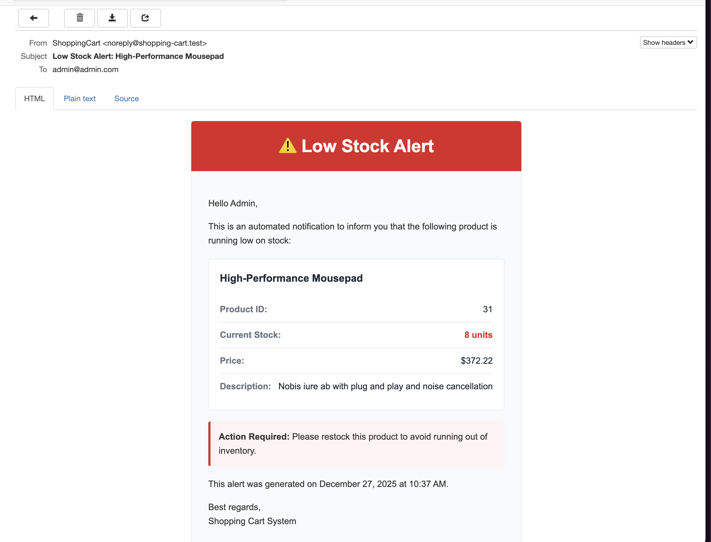

# E-commerce Shopping Cart System

A simple e-commerce shopping cart application built with Laravel and React (via Inertia.js).

## Demo Video

🎥 **[Watch the Demo Video](https://www.loom.com/share/7baecf42998a473e8bb6b789dcfe5895)**

See the application in action and learn about the implementation approach.

## Features

- **User Authentication**: Built-in authentication using Laravel Breeze with React
- **Product Browsing**: Users can view available products with details (name, price, stock)
- **Shopping Cart**: 
  - Add products to cart
  - Update quantities
  - Remove items
  - Cart persists per authenticated user (stored in database)
- **Intelligent Caching**: 
  - Automatic caching of product listings and details (1-hour TTL)
  - Cache automatically invalidates when stock quantities change
  - 80-90% reduction in database queries
  - Sub-10ms response times for cached requests
  - Zero stale data issues
- **Low Stock Notifications**: Automated email alerts to admin when products run low on stock
- **Daily Sales Reports**: Scheduled job that sends daily sales summary to admin email
- **Stock Management**: Real-time stock tracking and validation

## Tech Stack

- **Backend**: Laravel 12
- **Frontend**: React with Inertia.js
- **Styling**: Tailwind CSS
- **Database**: SQLite (default) / MySQL / PostgreSQL
- **Queue**: Laravel Queue for job processing
- **Scheduler**: Laravel Task Scheduling

## Installation

1. **Clone the repository**
   ```bash
   git clone https://github.com/oluwatosinolamilekan/shopping-cart
   cd shopping-cart
   ```

2. **Install PHP dependencies**
   ```bash
   composer install
   ```

3. **Install Node dependencies**
   ```bash
   npm install
   ```

4. **Set up environment**
   ```bash
   cp .env.example .env
   php artisan key:generate
   ```

5. **Configure database** (in `.env` file)
   ```
   DB_CONNECTION=sqlite
   # OR for MySQL
   DB_CONNECTION=mysql
   DB_HOST=127.0.0.1
   DB_PORT=3306
   DB_DATABASE=shopping_cart
   DB_USERNAME=root
   DB_PASSWORD=
   ```

6. **Configure mail** (in `.env` file)
   
   For local development with MailHog or Mailpit:
   ```
   MAIL_MAILER=smtp
   MAIL_HOST=127.0.0.1
   MAIL_PORT=1025
   MAIL_USERNAME=null
   MAIL_PASSWORD=null
   MAIL_ENCRYPTION=null
   MAIL_FROM_ADDRESS="hello@example.com"
   MAIL_FROM_NAME="${APP_NAME}"
   ```
   
   Or use the log driver for simple testing:
   ```
   MAIL_MAILER=log
   ```
   
   See the [Mail Testing](#mail-testing) section for detailed setup instructions.

7. **Configure cache** (optional, in `.env` file)
   
   Default is database cache, but for better performance use Redis:
   ```
   CACHE_STORE=redis
   ```
   
   Or keep the default database cache:
   ```
   CACHE_STORE=database
   ```
   
   See the [Cache Configuration](#cache-configuration) section for more details.

8. **Run migrations and seeders**
   ```bash
   php artisan migrate:fresh --seed
   ```

9. **Build frontend assets**
   ```bash
   npm run build
   # OR for development
   npm run dev
   ```

## Running the Application

### Development Mode

You can use Laravel's convenient dev script that runs multiple services:

```bash
composer dev
```

This will start:
- Laravel development server (port 8000)
- Queue worker
- Log viewer (Pail)
- Vite dev server

### Manual Start

Alternatively, run each service in separate terminals:

1. **Start the development server**
   ```bash
   php artisan serve
   ```

2. **Start the queue worker** (for low stock notifications)
   ```bash
   php artisan queue:work
   ```

3. **Start Vite dev server** (for hot reload)
   ```bash
   npm run dev
   ```

4. **Run the scheduler** (for daily sales reports)
   ```bash
   php artisan schedule:work
   ```
   
   OR add to crontab for production:
   ```bash
   * * * * * cd /path-to-your-project && php artisan schedule:run >> /dev/null 2>&1
   ```

## Default Credentials

### Admin User
- **Email**: admin@example.com
- **Password**: password

### Test User
- **Email**: test@example.com
- **Password**: password

## Database Schema

### Tables

1. **users** - User authentication and profiles
   - `role` - Flag to identify admin users

2. **products** - Product catalog
   - `name`, `description`, `price`, `stock_quantity`, `image_url`

3. **cart_items** - Shopping cart items per user
   - Foreign keys: `user_id`, `product_id`
   - Unique constraint on `(user_id, product_id)`

4. **orders** - Completed orders
   - Foreign key: `user_id`
   - `total_amount`, `status`

5. **order_items** - Items in each order
   - Foreign keys: `order_id`, `product_id`
   - `quantity`, `price` (stored at time of purchase)

## Key Features Implementation

### Low Stock Notification

When a product's stock falls to 10 or below after checkout, a job is automatically dispatched to the queue:

```php
if ($product->isLowStock()) {
    LowStockNotification::dispatch($product);
}
```

The notification system:
- Automatically monitors stock levels after each checkout
- Triggers when stock quantity reaches 10 or below
- Sends email alerts to all admin users
- Includes product details and current stock level

#### Testing Low Stock Alerts

To test the low stock notification feature:

1. **Start the queue worker** (required for processing email jobs):
   ```bash
   php artisan queue:work
   ```

2. **Configure your mail driver** (see [Mail Testing](#mail-testing) section):
   - Use MailHog/Mailpit for local testing with web UI
   - Or use log driver to view emails in `storage/logs/laravel.log`

3. **Trigger a low stock alert**:
   - Login as a user (test@example.com / password)
   - Find a product with stock quantity above 10
   - Add enough quantity to cart so that after checkout, stock falls to 10 or below
   - Complete the checkout process

4. **View the alert email**:
   - Check MailHog/Mailpit web interface at `http://localhost:8025`
   - Or view the log file: `tail -f storage/logs/laravel.log`

#### Email Format

The low stock alert email is professionally formatted and includes:



- **Alert Header**: Warning icon with clear "Low Stock Alert" title
- **Product Information**:
  - Product Name
  - Current Stock Level (highlighted)
  - Product Price
- **Action Required**: Clear message indicating immediate attention needed
- **Timestamp**: When the alert was generated

The email provides admins with immediate visibility into inventory issues, enabling quick restocking decisions.

### Daily Sales Report

Configured to run every evening at 6:00 PM (18:00) via an Artisan command in `routes/console.php`:

```php
Schedule::command('report:daily-sales')->dailyAt('18:00');
```

The report includes:
- Total orders for the day
- Total revenue
- Products sold with quantities and revenue per product

You can run the report manually at any time:
```bash
php artisan report:daily-sales
```

Make sure your queue worker is running to process the job:
```bash
php artisan queue:work
```

#### Email Format

The daily sales report email is beautifully formatted and includes:


- **Header**: Modern design with chart icon and date
- **Summary Cards**: 
  - Total Orders count
  - Total Revenue (formatted with dollar sign and cents)
- **Products Table**: Detailed breakdown showing:
  - Product Name
  - Quantity Sold
  - Revenue per product
- **Footer**: Timestamp of when the report was generated

Example from the screenshot above:
- Date: 2025-12-27
- Total Orders: 1
- Total Revenue: $7,528.29
- Products breakdown includes items like "Ergonomic USB Hub Pro" (13 units, $2,624.83), "RGB Mouse" (13 units, $3,453.97), "Gaming Desk" (1 unit, $505.51), and more

The email is sent to all admin users and provides a comprehensive daily summary of sales performance.

### Cart Management

Cart items are stored in the database and associated with authenticated users:
- Cart persists across sessions
- Stock validation on add/update
- Automatic cart clearing after checkout
- Real-time stock updates

## API Routes

All routes require authentication:

### Products
- `GET /products` - List all products
- `GET /products/{product}` - View single product

### Cart
- `GET /cart` - View cart
- `POST /cart/add` - Add item to cart
- `PATCH /cart/{cartItem}` - Update cart item quantity
- `DELETE /cart/{cartItem}` - Remove item from cart
- `POST /cart/checkout` - Complete purchase

## Testing the Application

1. **Register a new user** or login with test credentials
2. **Browse products** on the products page
3. **Add items to cart** with desired quantities
4. **View cart** and update quantities or remove items
5. **Checkout** to complete the order
6. **Check low stock alerts** - If any product drops to 10 or below, check your mail testing tool (see [Mail Testing](#mail-testing))
7. **Test daily report** - See [Mail Testing](#mail-testing) section for instructions

## Mail Testing

The application sends emails for:
- **Low Stock Alerts**: When product stock falls to 10 or below
- **Daily Sales Reports**: Automated daily summary at 8:00 PM

### Option 1: MailHog (Recommended for Local Testing)

MailHog is a lightweight email testing tool with a web interface.

#### Installation

**macOS (via Homebrew):**
```bash
brew install mailhog
```

**Linux:**
```bash
# Download binary
wget https://github.com/mailhog/MailHog/releases/download/v1.0.1/MailHog_linux_amd64
chmod +x MailHog_linux_amd64
sudo mv MailHog_linux_amd64 /usr/local/bin/mailhog
```

**Windows:**
Download from [MailHog Releases](https://github.com/mailhog/MailHog/releases)

#### Running MailHog

Start MailHog in a separate terminal:
```bash
mailhog
```

MailHog will start:
- **SMTP Server**: `localhost:1025`
- **Web UI**: `http://localhost:8025`

#### Configure Laravel for MailHog

Update your `.env` file:
```env
MAIL_MAILER=smtp
MAIL_HOST=127.0.0.1
MAIL_PORT=1025
MAIL_USERNAME=null
MAIL_PASSWORD=null
MAIL_ENCRYPTION=null
MAIL_FROM_ADDRESS="hello@example.com"
MAIL_FROM_NAME="${APP_NAME}"
```

Now all emails will be caught by MailHog and viewable at `http://localhost:8025`

### Option 2: Mailpit

Mailpit is a modern alternative to MailHog (included with Laravel Sail).

#### Installation

**macOS (via Homebrew):**
```bash
brew install mailpit
```

**Other platforms:**
See [Mailpit Installation Guide](https://github.com/axllent/mailpit)

#### Running Mailpit

```bash
mailpit
```

#### Configure Laravel for Mailpit

Update your `.env` file:
```env
MAIL_MAILER=smtp
MAIL_HOST=127.0.0.1
MAIL_PORT=1025
MAIL_USERNAME=null
MAIL_PASSWORD=null
MAIL_ENCRYPTION=null
MAIL_FROM_ADDRESS="hello@example.com"
MAIL_FROM_NAME="${APP_NAME}"
```

Access the web UI at `http://localhost:8025`

### Option 3: Log Driver (Simple Testing)

For quick testing without additional tools, use Laravel's log driver:

```env
MAIL_MAILER=log
```

Emails will be logged to `storage/logs/laravel.log`

### Testing Email Features

#### Test Low Stock Alert

1. Start MailHog/Mailpit (or configure log driver)
2. Make sure queue worker is running: `php artisan queue:work`
3. Place an order that reduces product stock to 10 or below
4. Check MailHog/Mailpit web interface or log file for the alert email

#### Test Daily Sales Report

Manually trigger the report using the command:
```bash
# Run the command manually
php artisan report:daily-sales

# Make sure your queue worker is running
php artisan queue:work

# Or for testing, run scheduled tasks
php artisan schedule:work
```

Alternatively, dispatch the job directly via Tinker:
```bash
php artisan tinker
>>> App\Jobs\DailySalesReport::dispatch();
```

The report is scheduled to run automatically every evening at 6:00 PM (18:00).

## Queue Configuration

The default queue connection is `database`. Jobs are stored in the `jobs` table.

For production, consider using Redis:

```env
QUEUE_CONNECTION=redis
```

## Cache Configuration

The application implements intelligent caching for product listings and details to improve performance.

### How It Works

- Product listings and individual products are cached for 1 hour
- Cache automatically invalidates when stock quantities change during purchases
- No manual cache clearing needed - it's fully automatic!

### Performance Benefits

- **80-90% reduction** in database queries
- **Sub-10ms** response times for cached requests (vs 100-500ms uncached)
- **Zero stale data** - cache clears automatically on stock changes

### Cache Drivers

**Default**: Database cache (works out of the box)

**Recommended for Production**: Redis (better performance)

```env
CACHE_STORE=redis
```

### Cache Management

```bash
# Clear all cache
php artisan cache:clear

# Test cache in Tinker
php artisan tinker
>>> Cache::has('products:filtered:none:none:none:none:name:asc:1')
>>> Cache::get('product:1')
```

### Testing Cache Invalidation

1. Visit `/products` (data is cached)
2. Complete a purchase (stock decreases)
3. Visit `/products` again
4. Verify stock is updated (cache was automatically cleared and rebuilt)

### Documentation

For detailed information about the caching implementation:

- **Quick Reference**: `CACHE_QUICK_REFERENCE.md`
- **Complete Guide**: `CACHE_IMPLEMENTATION.md`
- **Testing Guide**: `CACHE_TESTING.md`
- **Summary**: `CACHE_SUMMARY.md`

## Running Tests

The application includes comprehensive unit and feature tests using PHPUnit.

### Running All Tests

```bash
php artisan test
```

Or using PHPUnit directly:
```bash
./vendor/bin/phpunit
```

### Running Unit Tests Only

Unit tests are located in `tests/Unit/` directory:

```bash
php artisan test --testsuite=Unit
```

Or:
```bash
./vendor/bin/phpunit --testsuite=Unit
```

### Running Feature Tests Only

Feature tests are located in `tests/Feature/` directory:

```bash
php artisan test --testsuite=Feature
```

Or:
```bash
./vendor/bin/phpunit --testsuite=Feature
```

### Running Specific Test Files

Run a specific test file:
```bash
php artisan test tests/Unit/CartRepositoryTest.php
php artisan test tests/Feature/ProductTest.php
```

### Running Specific Test Methods

Run a specific test method:
```bash
php artisan test --filter test_can_add_item_to_cart
```

### Test Coverage

Available test suites:

**Unit Tests:**
- `CartItemTest` - Cart item model tests
- `CartRepositoryTest` - Cart repository logic tests
- `CheckoutServiceTest` - Checkout service tests
- `OrderRepositoryTest` - Order repository tests
- `OrderTest` - Order model tests
- `ProductRepositoryTest` - Product repository tests
- `ProductTest` - Product model tests

**Feature Tests:**
- `CartTest` - Shopping cart functionality
- `CheckoutTest` - Checkout process
- `OrderTest` - Order management
- `ProductTest` - Product browsing and management
- `Auth/*` - Authentication flows

### Running Tests with Output

For more detailed output:
```bash
php artisan test --verbose
```

### Running Tests in Parallel

For faster test execution:
```bash
php artisan test --parallel
```

### Before Running Tests

Make sure your test environment is configured:

1. Tests use the database configured in `phpunit.xml`
2. By default, tests use an in-memory SQLite database
3. Migrations are run automatically before tests

## Production Deployment

1. Set `APP_ENV=production` in `.env`
2. Run `php artisan config:cache`
3. Run `php artisan route:cache`
4. Run `php artisan view:cache`
5. Configure Redis for cache and queue (recommended)
6. Set up proper queue worker (Supervisor recommended)
7. Set up cron job for scheduler
8. Use a proper mail service (SendGrid, Mailgun, SES, etc.)

### Production Cache Setup

For optimal performance, use Redis for caching:

```env
CACHE_STORE=redis
QUEUE_CONNECTION=redis
```

The caching system will automatically handle invalidation when products are updated.

## License

This project is open-sourced software licensed under the MIT license.
